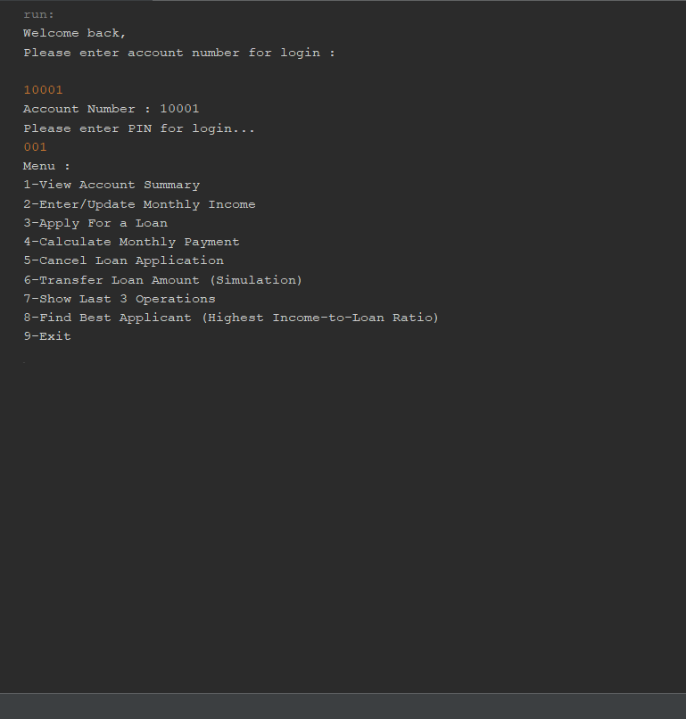

# java-bank-loan-system
Console-based bank loan management system developed in Java. Includes customer handling, loan application, and calculation features using a menu-driven interface.
## Screenshot

## Use Cases
This project can be adapted for:
- Programming assignments
- Student projects
- Console automation systems
